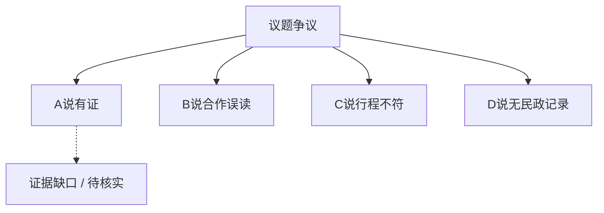

## 结论

该传闻证据不足，倾向不实。置信度：中。

<!-- confidence:mid -->
**置信度：中**

## 要点

- 当事人未证实
- 源头为匿名号
- 时间线矛盾

## 争议与不确定

- A说有证
- B说合作误读
- C说行程不符

## 证据与来源

### Evidence

据报道汇总尚无公开可查记录 [1]。

1. https://example.com/a
2. https://example.com/b

## 深入了解

### 内容分析 / Content Analysis

围绕争议点拆解：各方主张、可核对证据、仍不确定处。下表为冲突要点摘要（由结构后处理生成，需结合正文证据阅读）。

1. A说有证
2. B说合作误读
3. C说行程不符
4. D说无民政记录

### 关系拓扑 / Relationship Map

### 详细分析

专业分析段落。专业分析段落。专业分析段落。专业分析段落。专业分析段落。专业分析段落。专业分析段落。专业分析段落。专业分析段落。专业分析段落。专业分析段落。专业分析段落。专业分析段落。专业分析段落。专业分析段落。专业分析段落。专业分析段落。专业分析段落。专业分析段落。专业分析段落。专业分析段落。专业分析段落。专业分析段落。专业分析段落。专业分析段落。专业分析段落。专业分析段落。专业分析段落。专业分析段落。专业分析段落。专业分析段落。专业分析段落。专业分析段落。专业分析段落。专业分析段落。专业分析段落。专业分析段落。专业分析段落。专业分析段落。专业分析段落。专业分析段落。专业分析段落。专业分析段落。专业分析段落。专业分析段落。专业分析段落。专业分析段落。专业分析段落。专业分析段落。专业分析段落。专业分析段落。专业分析段落。专业分析段落。专业分析段落。专业分析段落。专业分析段落。专业分析段落。专业分析段落。专业分析段落。专业分析段落。专业分析段落。专业分析段落。专业分析段落。专业分析段落。专业分析段落。专业分析段落。专业分析段落。专业分析段落。专业分析段落。专业分析段落。专业分析段落。专业分析段落。专业分析段落。专业分析段落。专业分析段落。专业分析段落。专业分析段落。专业分析段落。专业分析段落。专业分析段落。专业分析段落。专业分析段落。专业分析段落。专业分析段落。专业分析段落。专业分析段…
