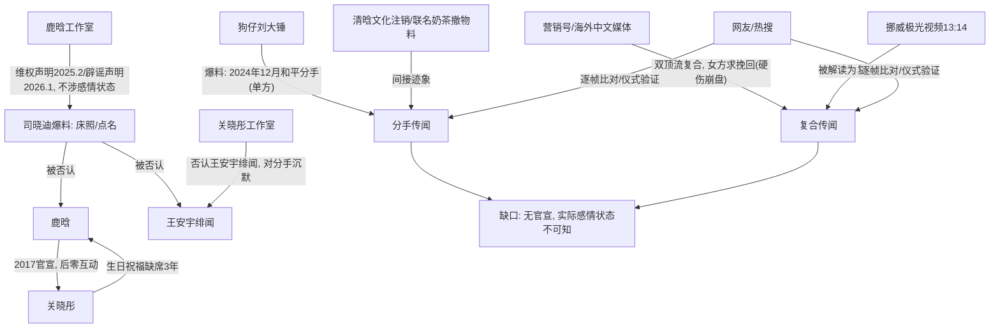

## TL;DR / 结论（标明置信度）

**核心事件**：鹿晗与关晓彤"是否已分手/是否已复合"的传闻自2025年起持续发酵，近两周（2026年9月中旬）因关晓彤29岁生日（9月17日）鹿晗连续第三年未公开送祝福而再度冲上热搜。**双方当事人及两家工作室从未正式确认分手，也从未确认复合**；2025年2月鹿晗工作室曾发维权声明否认"造谣传谣"，2026年1月双方工作室曾就司晓迪爆料同步发严正声明否认。分手说主要基于社交平台零互动超400天、生日祝福中断、联名商业体注销等**间接迹象**，均为推论而非官宣。

**置信度：高（对"分手未被官宣、传闻未被任何一方确认"这一元事实）**——此结论由腾讯新闻[1]、新浪[2]、联合早报[10]等多家独立来源交叉印证，且口径一致。**对"二人实际感情状态"本身：低置信度**——无任何直接证据，所有判断均为粉丝/营销号基于行为痕迹的推测。

## Conclusions

1. **这是典型的"沉默式分手罗生门"**：2017年10月8日鹿晗微博高调官宣恋情（"大家好，给大家介绍一下，这是我女朋友@关晓彤"），二人此后保持每年互庆生日的仪式（鹿晗4月20日、关晓彤9月17日），该仪式持续七年[1]。
2. **仪式断裂 + 商业切割构成"软分手"证据链**：2024年12月27日二人共同持股的清晗文化（厦门鹿彤影视）核准注销；联名奶茶"一鹿彤行"撤掉双人海报、线上账号停更[1]。2025年4月20日、9月17日及2026年4月20日、9月17日四轮生日互祝全部缺席[1][2][4]。
3. **复合说反复被炒又反复崩盘**：2026年3月15日"双顶流情侣已复合"空降热搜第一，但爆料称"双方均为三字姓名"与"鹿晗"二字存在硬伤，开场即崩盘[搜索结果-微博智搜][3]；2026年8月17日13:14鹿晗发挪威极光视频被解读为"一生一世"，又有网友扒出关晓彤同期定位亦在挪威，但后续信息显示更像四人朋友小团，截至8月底双方工作室均未确认同游或回应复合[1]。
4. **当事人的应对策略是"以事业内容替代感情回应"**：关晓彤以央视一套黄金档新剧《生逢其时》（2026年9月3日开播）为公开主线；鹿晗以音乐、综艺（《哈哈哈哈哈》第六季）、世界杯直播、公益项目为主要动态[1]。
5. **周边谣言多次被官方否认**：2026年1月网红司晓迪点名包括鹿晗、王安宇在内的多位男艺人并配"床照"截图，鹿晗工作室1月3日凌晨连发两份声明并甩出区块链存证[6]；关晓彤与王安宇新恋情传闻被两家工作室同步声明否认，王安宇后在杨天真播客中称两人"纯纯朋友"[1]。

## 冲突与不确定 / Conflicts & Uncertainties

| 主体 | 说法 | 冲突点 | 可能的口径原因 |
|---|---|---|---|
| 营销号/狗仔（刘大锤等） | 二人已于2024年12月"和平分手"[4]；2026年3月爆料"双顶流复合、女方恳求挽回"[9][Threads/setnews] | 分手时间、是否复合说法前后矛盾（先说2024年12月已分，又说2026年求复合） | 流量驱动，爆料依赖匿名信源，硬伤频出（"三字姓名"细节与鹿晗二字名不符） |
| 主流娱乐媒体（腾讯新闻等） | 仅陈述可核验事实：零互动超400天、工作室未发任何声明[1] | 与营销号"坐实分手"口径冲突——主流媒体强调"传闻未获当事人官宣" | 主流媒体需规避法律风险，只报道可验证事实 |
| 鹿晗工作室 | 2025年2月25日发维权声明，称监测到"针对鹿晗捏造发布虚假信息"[10]；2026年1月3日就司晓迪爆料连发两份声明+区块链存证[6]；ETtoday报道其就"买醉失态"传闻表态"已为不当行为承担"，同时称将起诉[5] | 只维权针对具体谣言（床照、失态），**从未正面确认或否认与关晓彤的恋爱状态** | 法律上仅对可起诉的具体不实信息维权；感情状态沉默可能是有意保留空间 |
| 关晓彤方面 | 2026年1月与王安宇绯闻由工作室声明否认[1] | 对分手/复合传闻完全沉默 | 同上；以剧宣填充舆论场 |
| 部分自媒体（Facebook帖等） | "陪着的男人竟然是他"暗示庆生现场有第三方男性[Facebook帖] | 单方宣称，无法核实庆生现场细节 | 标题党引流 |
| 台湾/海外媒体（SETN、HK01、文学城） | 转述"女方主动低头挽回"复合说[Threads][8][9] | 与"已分手"口径并存，同一媒体生态内自我矛盾 | 海外中文媒体多为二手转述，信源衰减严重 |

**无法核实项**：分手的确切时间（"2024年12月"仅为狗仔单方宣称）；复合传闻真伪；挪威同游是否属实；"1807万奶茶纠纷"与恋情无关，属并行事件但被营销号捆绑叙事。

## 时间线 / Timeline

- **2017-10-08**：鹿晗微博官宣恋情，微博服务器一度瘫痪[1]
- **2024-08**：日本街头被路人拍到同框，为可查到的最后一次公开同框[1]
- **2024-11**：鹿晗转发关晓彤《小巷人家》宣传微博后数分钟删除；此后再无互动[1]
- **2024-12-27**：清晗文化（厦门鹿彤影视）核准注销[1]
- **2025-01（2026年初司晓迪事件为2026年1月）**：见下
- **2025-02-25**：鹿晗工作室发维权声明[10]
- **2025-04-20**：鹿晗35岁生日，关晓彤未发零点祝福（仪式首次断裂）[1]
- **2025-09-17**：关晓彤28岁生日，鹿晗未发祝福[1]
- **2026-01**：司晓迪点名鹿晗、范丞丞等十余男艺人配"床照"；鹿晗工作室1月3日凌晨连发两份声明[6]；关晓彤与王安宇绯闻，双方工作室声明否认[1]
- **2026-03-15**："双顶流情侣已复合"空降热搜第一，因"三字姓名"硬伤崩盘[微博智搜][3]
- **2026-03-31前后**：文学城等媒体炒作"女方求复合"[8]
- **2026-04-20**：鹿晗36岁生日，关晓彤无动静[1]
- **2026-07**：王安宇上杨天真播客称与关晓彤"纯纯朋友"[1]
- **2026-08-17 13:14**：鹿晗发挪威极光视频无配文，被解读"一生一世"；同期关晓彤定位亦在挪威；后续称四人朋友小团；工作室未回应[1]
- **2026-09-03**：关晓彤主演《生逢其时》CCTV-1黄金档开播[1]
- **2026-09-13**：腾讯新闻发文梳理"早已拉开距离"[1]
- **2026-09-17**：关晓彤29岁生日，鹿晗连续第三年缺席祝福，话题再登热搜[2][4]

## Evidence

1. [1] 腾讯新闻《分手传闻一年多后，28岁关晓彤高调官宣喜讯》（2026-09-13）：零互动超400天（自2024年11月起算）；清晗文化2024-12-27核准注销；《生逢其时》2026-09-03于CCTV-1开播，28集（电视播26集）；鹿晗2026-08-17 13:14发挪威极光视频；截至8月底工作室未回应复合。
2. [2] 新浪娱乐（2026-09-17）：关晓彤29岁生日鹿晗祝福缺席，零互动超400天。
3. [4] 新浪（k.sina.com.cn）：狗仔刘大锤爆料称二人2024年12月和平分手——**单方宣称，无官方佐证**。
4. [6] 搜狐（m.sohu.com）：2026年1月司晓迪点名鹿晗等十余男艺人；鹿晗工作室2026-01-03凌晨连发两份声明、区块链存证。
5. [10] 联合早报（2025-02-26）：鹿晗工作室2025-02-25微博维权声明。
6. [微博智搜]（2026-03-15热搜复盘）："曝双顶流情侣已复合"因"双方均为三字姓名"与鹿晗二字名不符而崩盘。
7. [9] HK01 / [Threads @setnews]（2026-03-16前后）：网传"女方恳求复合"——单方宣称，遭"开场即崩盘"评价[3]。

## 已确认 vs 未确认 / Confirmed vs Unconfirmed

- **已确认（高置信度，多源一致）**：
  - 双方及两家工作室从未官宣分手，也从未官宣复合；2017年官宣微博仍保留[1]
  - 社交平台零互动超400天、四轮生日祝福缺席[1][2]
  - 清晗文化注销、联名奶茶双人物料撤除[1]
  - 鹿晗工作室2025年2月及2026年1月的维权/辟谣声明均未涉及感情状态本身[6][10]
  - 关晓彤与王安宇绯闻已被双方工作室否认[1]
- **未确认 / 无法确认（低置信度）**：
  - 是否实际已分手、"2024年12月分手"时间点（仅狗仔单方宣称）
  - 3月复合传闻、8月挪威同游是否属实（工作室未确认，有"四人小团"说法）
  - 庆生现场细节、"女方求复合"等衍生叙事

## Gaps in Knowledge

- 无法获取两家工作室微博原文全文以核对声明措辞是否隐晦提及感情状态。
- 司晓迪爆料的法律诉讼进展无后续可查信息。
- "1807万奶茶纠纷"具体司法文书未见，无法确认金额与责任归属。
- 挪威行程的同行人员构成仅有"后续信息显示"的模糊表述，缺乏影像独立佐证。

## 内容分析 / Content Analysis

- **叙事机制**：本事件是"仪式符号新闻学"的典型——主流媒体与网友均以"生日祝福是否出现"作为感情状态代理指标，当事人沉默本身成为被报道的内容。
- **营销号策略**：分手说与复合说交替输出，可双向收割流量且任一方向"命中"皆可宣称正确；爆料细节（如"三字姓名"）屡现硬伤，说明信源为推测而非内部消息。
- **当事人策略**：以可核验的事业节点（剧播、巡演、公益球场第14座落地河北承德[1]）持续供给公共内容，稀释八卦议题；法律手段仅针对具体可诉谣言（床照、失态），对感情状态保持"战略性沉默"以避免任何方向的官宣成本。

## 关系拓扑 / Relationship Map

## References

1. 腾讯新闻《分手传闻一年多后，28岁关晓彤高调官宣喜讯，和鹿晗早已拉开距离》，2026-09-13，https://news.qq.com/rain/a/20260913A0339R00
2. 新浪娱乐《关晓彤与鹿晗分手传闻是否属实》，2026-09-17，https://ent.sina.cn/2026-09-17/detail-iniscksh9222791.d.html
3. 腾讯新闻《鹿晗关晓彤8年恋情再出反转？》，2026-03-30，https://news.qq.com/rain/a/20260330A03IYL00
4. 新浪《关晓彤生日鹿晗祝福缺席引发热议》（含刘大锤"2024年12月和平分手"爆料转述），https://k.sina.com.cn/article_7879923377_1d5ae16b106801c8je.html
5. ETtoday星闻Facebook视频（鹿晗"买醉失态"传闻及工作室回应），https://www.facebook.com/ETtodaySTAR/videos/
6. 搜狐《分手传闻不到两年，鹿晗卡点发文大胆示爱》（司晓迪事件与1月3日声明），https://m.sohu.com/a/1065018710_122406105
7. 微博智搜"曝双顶流情侣已复合"热搜复盘（"三字姓名"硬伤），http://t.cn/AXVsb1gI
8. 文学城《鹿晗关晓彤8年恋情再出反转？女方求复合？》，2026-03-31，https://www.wenxuecity.com/news/2026/03/31/ent-286903.html
9. HK01《关晓彤被爆破分手传闻"恳求鹿晗复合"？》，https://global.hk01.com/人气娱乐/60331175/
10. 联合早报《关晓彤拼事业无缝接戏 鹿晗工作室发维权声明》，2025-02-26，https://www.zaobao.com.sg/entertainment/story20250226-5931935

\boxed{鹿晗与关晓彤分手-复合传闻近两周再上热搜，但截至2026年9月17日双方从未官宣分手亦未官宣复合——"已分手"实为基于零互动超400天与商业切割的间接推断（高置信度确认"未官宣"，低置信度判定感情实际状态），营销号分手/复合说法互相矛盾且多次出现硬伤，当事人以事业内容替代回应、仅就具体谣言法律维权。}

## 线索追踪 / Lead Trail

本轮未实际跟进额外线索（种子线索仍为 pending，不视为报告未写完）。

### 未跟进线索（摘要）

1. What are the most important unresolved or contested aspects of: 请锁定一条近两周娱乐圈多源… — **未跟进**
