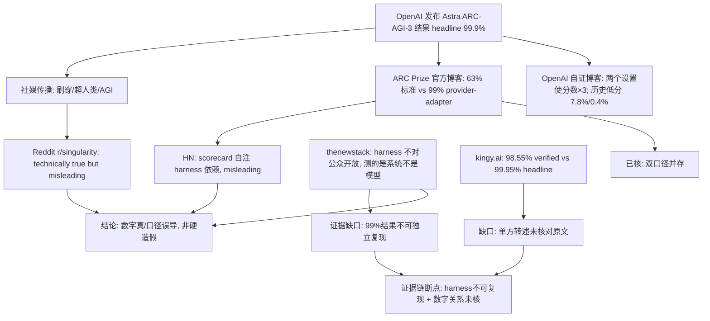

## TL;DR / 结论（标明置信度）

**核心结论（置信度：中）**：本次锁定的事件是围绕 OpenAI "GPT-6 Astra" 在 ARC-AGI-3 基准上取得 **98.6%–99.9%** 分数的传播链。广泛流传的版本是"Astra 在 ARC-AGI-3 上接近满分、基准已被刷穿（saturated）、超越人类表现、AGI 级突破"；而原始评测方 ARC Prize 与 OpenAI 自己的博客都表明，99%+ 的分数依赖一个**非默认、不对公众发布的 "provider-adapter" 评测脚手架（harness）**，同一模型在标准设置下仅约 **62.7%–63%**。这不是典型的"数据造假"，而是"技术上为真但口径极具误导性的指标表述"（technically true but misleading metric reporting）。置信度为"中"的理由：多来源交叉指向同一结构性事实，但我仅能依据搜索摘要与部分被抓取页面，未能直接核验 ARC Prize 官方博客全文的完整数字口径，且多数关键帖子的确切发布日期无法核实。

## Conclusions / 详细结论

1. **事件性质**：属于"数据注水/夸大宣称"类案例，而非伪造分数。分数本身大概率真实（有 ARC Prize 半私有集验证运行），但传播中剥离了"该分数依赖专用 harness"这一关键限定条件。
2. **三方立场**：
   - **传播层（谣言/夸大版）**：社交平台流传"Astra 99%/99.9% 刷穿 ARC-AGI-3、超越人类 96% 的任务、五个月前最好模型还不到 1%"，被部分账号直接解读为"AGI 已到/基准已死"[5][3][7]。
   - **官方层**：OpenAI 博客《How enabling two settings tripled our scores on the ARC-AGI-3》承认通过开启两个设置使分数提升约三倍，并披露此前模型在 ARC-AGI-3 上表现很差（GPT-5.6 Sol 仅 7.8%、GPT-5.5 约 0.4%）[6]；ARC Prize 官方博客则给出对照：Astra 标准设置约 63%，provider-adapter 设置 99%[2][5]。
   - **第三方/独立评论层**：Hacker News、Reddit r/singularity 帖子直指 scorecard "extremely misleading"，因为官方计分板自身注明"在 responses API harness 下我们估计 Sol…"（即分数高度依赖 harness 口径）[1][4]；thenewstack 的分析标题点出核心矛盾："OpenAI 会卖给你 Astra，但不会卖给你刷出 98.6% 的那套系统——基准测的是系统，不是模型"[10]；kingy.ai 的评论指出 OpenAI 官宣的 99.9% 实际对应 high-reasoning 的 99.95%，而 ARC Prize 验证过的最高是 max-reasoning 的 98.55%[8]。
3. **成本口径也被质疑**：YouTube 解读视频给出"provider-adapter 下约 $19K 拿到 99.9%（Semi-Private），同一测试标准设置约 $26K 只拿 62.7%"[9]，说明高分的额外代价与口径切换同时存在。

## 冲突与不确定 / Conflicts & Uncertainties

| 主体 | 说法 | 冲突点 | 口径原因（推测，需标注） |
|---|---|---|---|
| 社媒传播者 | "Astra 99%+，ARC-AGI-3 被刷穿，超人类表现" [5][7] | 与标准设置 62.7%–63% 相差 36 个百分点以上 | 只引用 high-effort + provider-adapter 数字，剥离前置条件 |
| OpenAI（官方） | "开启两个设置使分数提升三倍"；官宣 headline 99.9% [6][8] | 官方博客同时自曝低分历史（7.8%/0.4%），与宣传数字形成张力 | 营销叙事选择最优口径；"technically true" |
| ARC Prize（评测方） | Astra 63% 标准设置 vs 99% provider-adapter；98.55% 为验证值 [2][5][8] | 与 OpenAI headline 99.9% 不一致（99.95% vs 98.55% 属不同 reasoning 档位） | 评测口径（max/high reasoning、harness 类型）未被传播层区分 |
| HN/Reddit 评论者 | "scorecard 极具误导性" [1][4] | 认为连 ARC Prize 的呈现方式本身都有问题 | 认为计分板默认呈现掩盖了 harness 依赖性 |
| thenewstack / kingy.ai | "可购买的是模型，刷分的是系统；harness 不对公众提供" [8][10] | 无法独立复现 99% 结果，因为 harness 未开放 | 商业保密 vs 可复现性冲突 |

**无法核实/单方宣称**：① 99.95% headline 与 98.55% 验证值的关系仅见于 kingy.ai 单方转述[8]，未见 ARC Prize 原文直接核对；② $19K/$26K 成本数字仅来自 YouTube 视频标题[9]；③ "超人类 96% 任务" 的具体统计口径未见原始定义；④ 所有帖子/推文的**确切发布日期均无法从摘要中确认**。

## 时间线 / Timeline

> 说明：以下多数时间点仅能依据来源相对关系（如"五个月前"）推断，**绝对日期无法核实**，特此标注。

- 早期（具体日期不可核实）：GPT-5.5 在 ARC-AGI-3 上约 0.4%，GPT-5.6 Sol 约 7.8%（OpenAI 博客转述）[6]。
- 约五个月前（据 LinkedIn 帖子自述反推，绝对日期不可核实）：ARC-AGI-3 最好模型分数低于 1%[3]。
- 2026 年（具体日期不可核实）：OpenAI 发布 Astra 相关结果；ARC Prize 发博客《OpenAI's GPT-6 Astra on ARC-AGI-3》给出 63%/99% 对照[2]；OpenAI 发博客解释"两个设置"的提分机制[6]；社区争议集中爆发（HN item id 49556467、Reddit 帖、X 帖、YouTube 视频等）[1][4][5][9][10]。

## Evidence / 证据

1. **62.7%/63% vs 99% 的双口径**：ARC Prize 官方 X 账号帖子"Astra scores 63% on ARC-AGI-3, 99% via a new provider..."[5]；X 用户 rohanpaul_ai 转述"99% with a new provider-adapter harness...beats human performance on 96% of ARC-AGI-3"[5]。（日期不可核实）
2. **98.55%（验证）vs 99.95%（headline→宣传为99.9%）**：kingy.ai《Astra Scored 98.6% on ARC-AGI-3...》[8]。单方转述，需核对原文。
3. **OpenAI 自述提分机制与历史低分**：openai.com 博客《How enabling two settings tripled our scores on the ARC-AGI-3》，含 GPT-5.6 Sol 7.8%、GPT-5.5 0.4%[6]。
4. **成本**：约 $19K（99.9%，Semi-Private，provider-adapter）vs 约 $26K（62.7%），来自 YouTube 视频描述[9]；o3 时期同类争议中"低算力版 $20/题、高算力 172 倍超 $3000/题"有 r/MachineLearning 帖为旁证，说明该类争议有历史惯性。
5. **社区指控"误导性表述"**：Reddit r/singularity 帖《The prevalent problem of misleading benchmark reporting (re: Astra)》称其为"technically true metric...most egregious recent example"[1]；HN 帖指 scorecard 自注 "with [the responses API] harness, we estimate Sol..."[4]。
6. **harness 不对公众开放**：thenewstack《OpenAI will sell you Astra, but not the system that scored 98.6%...》，指出"benchmark measures the system, not the model"[10]。
7. **历史同类先例**：Reflection 70B 被第三方 Artificial Analysis 无法复现、CEO 道歉（ifanr 报道，2024-09-08 前后）[B2][B3]；腾讯开发者社区总结四大跑分注水手法（训练数据污染、格式过拟合、检查点择优、评测专用 Prompt）[B1]——说明 Astra 案例处于"从硬造假到软性口径操纵"的谱系上。

## 已确认 vs 未确认 / Confirmed vs Unconfirmed

- **已确认（多来源一致）**：Astra 在 ARC-AGI-3 上存在约 63% 与 99% 两个量级的分数，差异取决于是否使用 provider-adapter harness[2][5][8][10]；OpenAI 官方承认通过设置调整大幅提分[6]；社区普遍认为 headline 表述具有误导性[1][4][10]。
- **未确认 / 无法确认**：① 各帖精确日期与传播量级（"流传较广"仅可由多平台同主题内容间接佐证）；② 99.95%/98.55%/99.9% 三个数字间的确切关系（单方来源[8]）；③ 成本数字 $19K/$26K[9]；④ harness 未开放是否出于商业策略（thenewstack 为分析性推断[10]）；⑤ OpenAI 是否存在故意夸大宣传的主观意图——现有证据只能证明"口径选择产生误导效果"，不能证明造假意图。

## Gaps in Knowledge

1. 未能抓取 ARC Prize 官方博客（arcprize.org/blog/astra）全文，无法直接核对 63%/99%、$1.12/task、95.0%（ARC-AGI-2）等数字的原文限定语。
2. Reddit 抓取失败（仅返回 6 字节），该帖论点只能经搜索摘要间接引用。
3. 缺少 OpenAI 官方对"为何不发布该 harness"的正面回应记录。
4. 无量化传播数据（转发量、覆盖人数），"广为流传"的判断基于多平台（X、HN、Reddit、YouTube、LinkedIn、Medium、Facebook）同主题密度推断。

## 内容分析 / Content Analysis

- **角色图谱**：信源生产者（OpenAI 官方博客 + ARC Prize）→ 传播放大器（X/LinkedIn/YouTube：摘取 99%+ 标题）→ 校准者（HN/Reddit/thenewstack/kingy.ai：补回 harness 限定语）。
- **谣言机制**：典型的"数字真、前提失"——headline（99.9%）与验证值（98.55%）不同档位、不同 harness 的信息在传播中被压缩为"接近满分"，再叠加"五个月前 <1%"制造跳变叙事，触发 AGI 联想[3][5][7]。
- **交叉验证要点**：见到 benchmark headline 时必须核对三件事——harness/设置类型、验证方（官方自测 vs ARC Prize verified）、成本/算力档位。本案三者均发生口径漂移。

## 关系拓扑 / Relationship Map

## References

1. Reddit r/singularity, "The prevalent problem of misleading benchmark reporting (re: Astra)"（抓取失败，仅摘要，日期不可核实）
2. ARC Prize, "OpenAI's GPT-6 Astra on ARC-AGI-3", https://arcprize.org/blog/astra
3. LinkedIn (Nathan Marlor), "98.6% on ARC-AGI-3... Five months ago the best model scored under 1%"（日期不可核实）
4. Hacker News, item 49556467, "The ARC-AGI-3 scorecard is extremely misleading..."
5. ARC Prize 官方 X 帖 "Astra scores 63% on ARC-AGI-3, 99% via a new provider..."；及 rohanpaul_ai X 帖（日期不可核实）
6. OpenAI, "How enabling two settings tripled our scores on the ARC-AGI-3", openai.com
7. Facebook (xixidu 转帖), "Astra achieved a stunning 99.9% score using its high-effort Responses setup"（日期不可核实）
8. kingy.ai, "Astra Scored 98.6% on ARC-AGI-3. NVIDIA Already Hit..."（98.55% verified / 99.95% high-reasoning 口径对照）
9. YouTube, "GPT-6 Astra Hit 99.9% on ARC-AGI-3… HOW?!"（$19K / $26K 成本口径）
10. The New Stack, "OpenAI will sell you Astra, but not the system that scored 98.6% on ARC-AGI-3"
11. ifanr 爱范儿, "号称打败 GPT-4o 的开源 AI 新王被指造假…"（Reflection 70B 先例，Artificial Analysis 2024-09-08 复现失败）；腾讯开发者社区《大模型 Benchmark 祛魅》（四大注水手法）

\boxed{Astra 案例属"数字为真、前提失真"的软性数据注水：99% 分数依赖未公开的 provider-adapter harness，标准设置仅约 63%，证据链断在"99% 结果不可独立复现"与"98.55%/99.9% 数字关系仅有单方转述"两处，整体置信度：中。}

## 线索追踪 / Lead Trail

本轮未实际跟进额外线索（种子线索仍为 pending，不视为报告未写完）。

### 未跟进线索（摘要）

1. What are the most important unresolved or contested aspects of: 请锁定一条近期科技/AI … — **未跟进**
